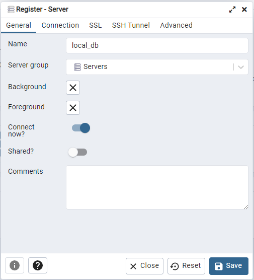

## Description

This project was created using [Nest](https://github.com/nestjs/nest) framework TypeScript starter repository.
This is a CRM project for a technical interview. We wanted to treat this as a real production project, so from now on all the documentation will be written as this project was production-ready. There will be explanation for the decisions taken.

If you are not part of the company that is interviewing, thanks for comming around and feel free to contribute and share any ideas on how to improve it. We can all use this to improve ourselves at the very least.

## Installation

```bash
$ npm install
```

## Running the app

```bash
# development
$ npm run start

# watch mode
$ npm run start:dev

# production mode
$ npm run start:prod

# start database
$ npm run db:start

# init database
$ npm run db:init

# seed database
$ npm run db:seed

# format code
$ npm run lint
```

## Test

Tests are done using jest. Only unit tests are implemented for the sake of time.

```bash
# unit tests
$ npm run test

# test coverage
$ npm run test:cov
```

## Framework

ToDo

## Architecture

ToDo

### Users

### Admins

### Customers

## Authentication

We didn't want to build our own Authentication service as dealing with encrypting passwords and managing it in our DB would be costly in time and provide little to no value over using a 3rd party one.

Auth0 was implemented as our authentication service. You can find in the `.env.example` file the required Auth0 ids. These ids aren't shared for security reasons, so please reach out to `jousema.fernandez@gmail.com` if you need these keys.
Auth0 is one of the most consumed authentication services and we are able to automatically allow social login using Google as well as protect using JWT and more, with minimal effort.

### Auth Guards

We protect our controllers routes using `@UseGuards(AuthGuard('jwt'))`. See for example the `health.controller.ts`:

```typescript
@UseGuards(AuthGuard('jwt'))
  @Get('/auth')
  checkAuth(): string {
    return this.healthService.checkAuth();
  }
```

NestJS AuthGuards provide an easy way of protecting our API for unauthorized users and will automatically either allow access to the code or deny access and throw an Unauthorized error. See that we didn't code any error thrown.

The `'jwt'` param in the `AuthGuard('jwt')` decorator refers to `ioc/jwt/jwt.strategy.ts` that uses both the `Passport strategy` built from NestJS and is connected to our Auth0 account. This was done following [Auth0's documentation](https://auth0.com/blog/developing-a-secure-api-with-nestjs-adding-role-based-access-control/) and using a [Passport strategy](http://www.passportjs.org/packages/passport-jwt/).

### How to Login

Because this is only the API and we have no UI to login and in order to save time, we are currently login this API using the Application Test features from Auth0.


This should be already set up and no config is needed from devs. You can retrieve a token calling the `GET: http://localhost:8000/api/auth` endpoint.

## DB

We use PostgreSQL with Docker (you can install Docker [here](https://docs.docker.com/desktop/#download-and-install)).
Once you have installed Docker and restarted your machine, you can use `npm run db`.
This script executes `docker compose` that will create a `PostgreSQL` volume with a user and a password provided via `.env`. You can check them in. `.env.example` and ask them to `jousema.fernandez@gmail.com`. It will also create a db called `dev` and a pgAdmin volume that you can access using the credentials from the `.env` file and in url `localhost:5050`.

Once you are in pgAdmin, you will have to connect to the postgres server we just created.

Go to left menu, right click on Register, then go to Server... and a pop up will appear.


On the pop up, introduce the following values on the General tab:



and the following on Connection tab:


where the `Username` field corresponds to `POSTGRES_USER` in `.env` fiel and Password, `POSTGRES_PWD`.

Now, the DB is set up, but empty. You can run `npm run db:init` to create the tables and `npm run db:seed` to add a few dummy customers, users and admins if you want. This can be useful to test using fake data in the UI, isntead of tests.

## API Documentation

ToDo
We use [Swagger for NestJS](https://docs.nestjs.com/openapi/introduction). Go to this URL: `localhost:8000/api` to retrieve the API usage documentation

You can find the postman api collection at `/public/postman`
